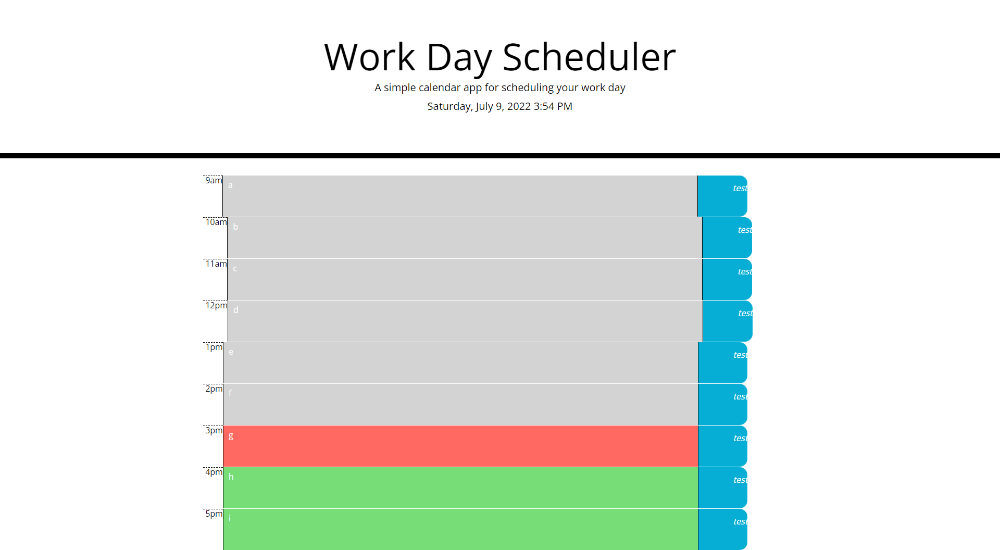

# My Planner #

**This repository contains the source code for Module 5**

## This project is an everyday planner.  It keeps track of the current time, and is color coordinated.  If the time is later than one of the hours on the calendar, the block will be grey.  The current hour shows up in red, and future hours in green.  The calendar also allows you to enter in text. ##

## Live Website ##

https://dominicfisher18.github.io/My-Planner/

## Screenshot ##

